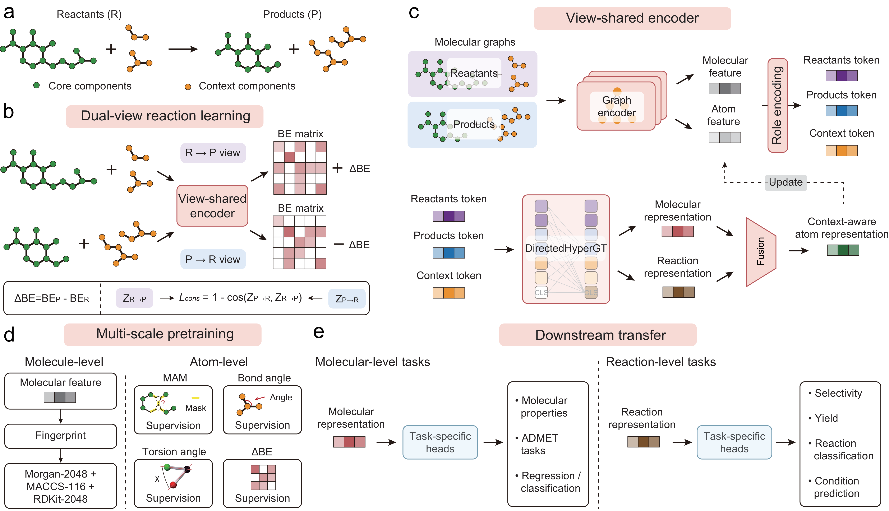

# Reaction-aware hypergraph learning of chemical representations with LARK



Minimal implementation of **LARK** accompanying the paper.

LARK is a unified framework for **L**earning **A**tom–molecule–**R**eaction
**K**nowledge from chemical transformations. LARK learns bidirectional
bond–electron changes and integrates information across atomic, molecular and
reaction levels through role-aware hierarchical interactions. The resulting
chemical representations support both molecular property and reaction prediction.

This package includes full-model pretraining and two fine-tuning examples:
ESOL molecular property regression and Schneider reaction classification.

The public project name is LARK and the installation distribution is
`lark-chem`. The Python namespace `hypermol`, the `HYPERMOL_*` environment
variables and the existing data-format identifiers are retained for compatibility
with the original implementation and stored artifacts. Commands below use these
unchanged technical names. Model architecture, training objectives and numerical
hyperparameters are unchanged by the naming update.

## Installation

Use Python 3.12 on Linux. From this directory:

```bash
python -m venv .venv
source .venv/bin/activate
python -m pip install --upgrade pip
python -m pip install .
```

The package declares the dependency versions used for verification, including
PyTorch 2.8.0, PyG 2.7.0 and RDKit 2024.9.4. PyTorch selects CPU execution when
CUDA is unavailable; the full pretraining configuration is intended for a CUDA
GPU. TensorBoard logging is optional (`python -m pip install '.[logging]'`).
No separate `torch-scatter` installation is required by these entrypoints.

Check the installation without downloading any datasets:

```bash
python scripts/check_install.py
```

This runs preprocessing, one optimizer step per training task, validation,
checkpoint saving and pretrained-weight transfer on synthetic examples using CPU.
It uses a small 32-dimensional, one-layer model to keep the check inexpensive.
Synthetic property/class labels are arbitrary and have no chemical interpretation.
Temporary data, logs and weights are deleted automatically. The full model size
is specified in the configurations below.

Use `python scripts/check_install.py --full-model` to run the same synthetic
check with the supplied 256-dimensional, six-layer encoders. This takes more CPU
time and memory; it still performs only one optimizer step per task.

## Paths

Run the following in this directory, including when the package is installed
as a wheel. None of the commands depend on the authors' workstation paths.

```bash
export HYPERMOL_PROJECT_ROOT="$PWD"
export HYPERMOL_DATA_ROOT="$PWD/data"
export HYPERMOL_RESULTS_ROOT="$PWD/results"
unset HYPERMOL_SERVER
```

Data and pretrained weights are not bundled. Training creates its own outputs
under `HYPERMOL_RESULTS_ROOT`. Use a new `run_name` for subsequent independent runs.

## Pretraining data

Supply `data/raw_pretrain/train.csv` and `data/raw_pretrain/test.csv` with:

| Column | Contents |
|---|---|
| `reactant_smiles` | Dot-separated mapped reactant components |
| `prod_smiles` | Dot-separated mapped product components |
| `unmapped_components` | Dot-separated unmapped context components; may be empty |

Atom maps must be positive and unique within each reaction side, and must
consistently identify the same atoms across sides. The BE target requires this
correspondence. If starting from unmapped reactions, perform atom mapping before
this step; an atom mapper is not included in the installation requirements.
For the study corpus, use the corresponding ORDerly/ORD reaction records and
the data preparation described in the manuscript. The package also accepts
other reaction collections in the same schema.

```bash
python scripts/prepare_pretrain.py \
  --raw-root "$HYPERMOL_DATA_ROOT/raw_pretrain" \
  --output-root "$HYPERMOL_DATA_ROOT/pretrain" \
  --workers 4 --map-size-gb 64
```

The output directory must be empty. This builds mapped-core and context LMDB
stores using the supplied molecular structures and RDKit geometry generation.
`--map-size-gb` sets the LMDB address-space limit; increase it for a larger corpus.
Feature failures stop preparation instead of silently passing missing records
to the trainer. Correct the input and use a fresh output directory when retrying.

The training configuration creates a validation split from the training pool
(target fraction 5%) while keeping connected reaction-side identity groups
together. It checks duplicate reactions and cross-split identity overlap.
Actual split sizes depend on the supplied corpus and grouping.

## Full-model pretraining

```bash
python -m hypermol.training.pretrain --config configs/pretrain.yaml
```

Model and training parameters are defined in [configs/pretrain.yaml](configs/pretrain.yaml).

Both directions share parameters; each view encodes its source-side mapped
components together with unmapped context. Target-side changes define the
supervision. The ΔBE head does not consume target-derived BE pair features.

For two GPUs, set `batch_size: 4` in the same YAML to preserve the global batch
of eight reactions, then run:

```bash
torchrun --standalone --nproc_per_node=2 \
  -m hypermol.training.pretrain_ddp --config configs/pretrain.yaml
```

Resume a run with `--resume_path /path/to/latest.pt`. The pretrained weight used
by both fine-tuning examples defaults to `results/pretrain/lark/best.pt`.

## Fine-tuning example 1: molecular property regression

Place the ESOL `delaney-processed.csv` file in `data/raw_esol/`. The processor
reads `smiles` and `measured log solubility in mols per litre`, generates
SMILES-derived features, and creates scaffold-disjoint train/validation/test
splits and a data manifest. Other descriptor columns are not model inputs.

```bash
python -m hypermol.data.process_moleculenet \
  --dataset esol \
  --raw_csv "$HYPERMOL_DATA_ROOT/raw_esol/delaney-processed.csv" \
  --output_root "$HYPERMOL_DATA_ROOT/esol"
python -m hypermol.training.finetune_property \
  --config configs/finetune_esol.yaml
```

The example fine-tunes the molecular encoder and regression head. Parameters are
defined in [configs/finetune_esol.yaml](configs/finetune_esol.yaml).

## Fine-tuning example 2: reaction classification

Place the Schneider train/valid/test CSVs in `data/raw_schneider/`. Each needs
`reactant_smiles`, `prod_smiles` and `reaction_type`. Reaction types are contiguous
zero-based integer labels shared by the three splits. Supply the desired
benchmark splits; this processor preserves them.

```bash
python -m hypermol.data.process_reaction_class \
  --raw_root "$HYPERMOL_DATA_ROOT/raw_schneider" \
  --output_root "$HYPERMOL_DATA_ROOT/schneider"
python -m hypermol.training.finetune_reaction_class \
  --config configs/finetune_schneider.yaml
```

The example fine-tunes the reaction encoder and classification head. Parameters are
defined in [configs/finetune_schneider.yaml](configs/finetune_schneider.yaml).
The classification trainer also records test metrics during training.

These are two runnable parameter examples. They are not an exhaustive recipe
listing for every benchmark reported in the manuscript.

## Package layout

```text
configs/              Full pretraining and two fine-tuning configurations
scripts/              Pretraining-data preparation and synthetic runtime check
src/hypermol/data/    Molecular features, BE matrices, datasets and batching
src/hypermol/models/  Encoders, fusion and prediction heads
src/hypermol/losses/  Pretraining and downstream objectives
src/hypermol/training/ Training and fine-tuning entrypoints
src/hypermol/utils/   Configuration, metrics, logging and checkpoint utilities
```

The source package contains no ablation experiment suite, plotting scripts,
benchmark results, training logs, pretrained checkpoints or manuscript files.
